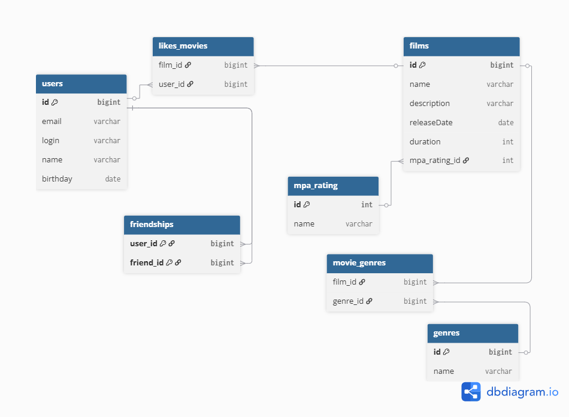

# java-filmorate
Template repository for Filmorate project.



Запрос на популярные фильмы
```
SELECT f.id, f.name, COUNT(lm.film_id)
FROM films AS f
LEFT OUTER JOIN likes_movies AS lm ON f.id = lm.film_id
GROUP BY f.id, f.name
ORDER BY COUNT(lm.film_id) DESC
```

Запрос на конкретный фильм (id = 1)
```
SELECT f.name, f.description, f."releaseDate", mr.name
FROM films AS f
JOIN mpa_rating AS mr ON f.mpa_rating = mr.id
WHERE f.id = 1
```

Запрос жанров к конкретному фильму (id = 2)
```
SELECT ge.name
FROM films AS f
JOIN movie_genres AS mg ON f.id = mg.film_id
JOIN genres AS ge ON mg.genre_id = ge.id
WHERE f.id = 2
```

Запрос на список друзей пользователя (id = 1)
```
SELECT friend.name
FROM users AS u
JOIN friendships AS f ON u.id = f.user_id
JOIN users AS friend ON f.friend_id = friend.id
WHERE u.id = 1
```

Запрос общих друзей (id = 1, id = 2)
```
SELECT friend.name
FROM users AS u
JOIN friendships AS f ON u.id = f.user_id
JOIN users AS friend ON f.friend_id = friend.id
WHERE u.id = 1 
	AND f.friend_id IN (
    	SELECT f2.friend_id
		FROM friendships AS f2
      	WHERE f2.user_id = 2
    	)

```